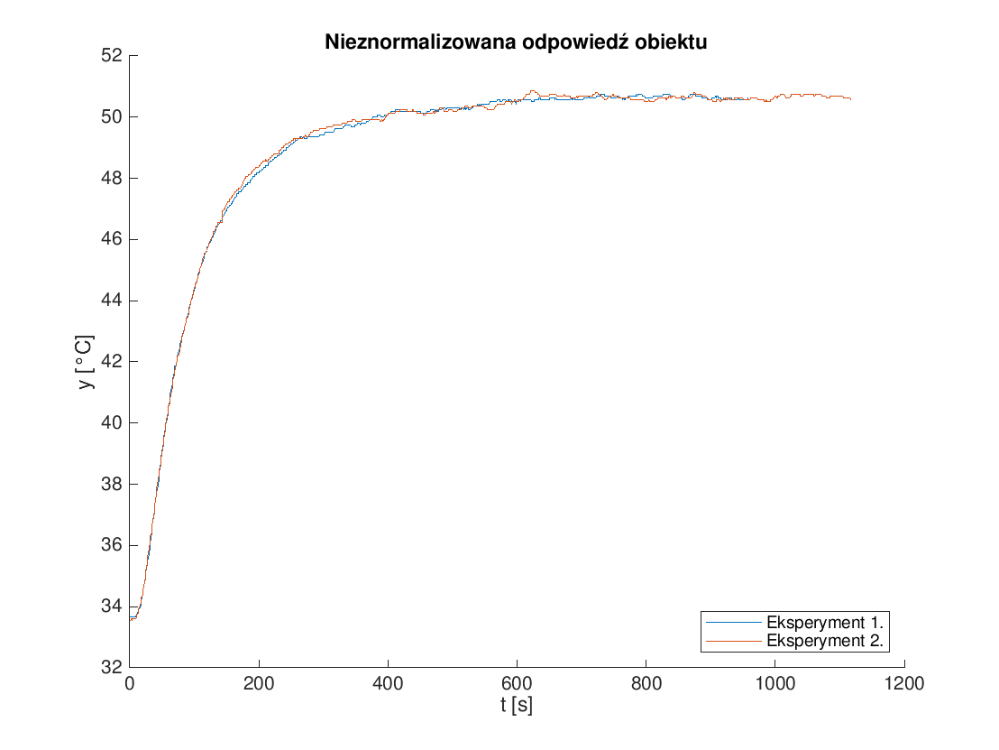
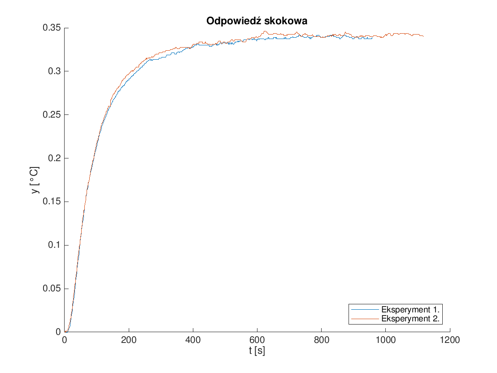

% SMS - Projekt 2
% Krystian Chachuła
  Marcin Dolicher
% 15. grudnia 2018

# Zadanie

Postawione przed nami zadanie polegało na stworzeniu regulatora DMC, który miał utrzymywać temperaturę na stanowisku grzejąco-chłodzącym. Głównym celem tego projektu było jednak stworzenie interfejsu operatora z uwzględnieniem dobrych praktyk w projekowaniu HMI oraz reakcją na stany awaryjne.

\newpage

# Obiekt regulacji

Obiektem regulacji było stanowisko grzejąco-chłodzące. Obiekt ten jest opisany   w poniższej tabeli.

sygnał                          opis                                     min                         max
---------------                 --------------------------------------  --------------------------- -----------------------
wyjście obiektu                 temperatura mierzona sondą T1           $-55\;\text{\textdegree}C$  $+125\;\text{\textdegree}C$
wejście obiektu                 średnie napięcie na grzałce G1          $-50\;\%$                   $+50\;\%$
zakłócenia (wej. niesterowane)  prędkość kątowa łopatek wentylatora W1  n/d                         n/d

![Stanowisko termiczne, schemat[^1]](Zdjęcia do sprawka/term_sch.jpg){ width=75% }

![Stanowisko termiczne, zdjęcie[^1]](Zdjęcia do sprawka/term.jpg){ width=75% }

[^1]: Źródło: K. Czerwiński, S. Plamowski, A. Wojtulewicz; Laboratorium przedmiotu Systemy DCS i SCADA

# Odpowiedź skokowa

Regulator DMC używa modelu obiektu w postaci odpowiedzi skokowej. Jest to odpowiedź obiektu na skok sygnału sterującego równy +1. Aby ją uzyskać, w stanie ustalonym, zwiększyliśmy wartość sygnału sterującego obiektem z $-20$ na $30$ i zarejestrowaliśmy próbki wartości wyjścia obiektu wraz z wartością sygnału sterującego w celu rozstzygnięcia chwili skoku w późniejszej analizie. Eksperyment ten powtórzyliśmy w celu weryfikacji otrzymanych wyników.

Następnie ze wszystkich próbek wybraliśmy te, które zostały zarejestrowane po skoku sygnały sterującego. Pierwsza rozpatrywana próbka była następną po skoku.

{ width=75% }

Kolejnym krokiem była normalizacja odpowiedzi obiektu. Próbki wyjścia procesu pomniejszyliśmy o wartość pierwszej z rozpatrywanych. Aby zakończyć normalizację, podzieliliśmy rozpatrywane próbki przez $50$, ponieważ o tyle zwiększyliśmy wartość sygnału sterującego podczas eksperymentu.

{ width=75% }

Do dalszych rozważań wybraliśmy odpowiedź z eksperymentu pierwszego, ponieważ nie zawuważyliśmy istotnych różnic między wynikami obydwu eksperymentów.

# Algorytm DMC

Z wykresu odczytaliśmy horyzont dynamiki obiektu tzn. liczbę kwantów czasu (próbek) potrzebnych obiektowi do ustabilizowania się po skoku sygnału sterującego. $y$ wydaje się przestawać rosnąć w okolicach $600$ próbki, zatem przyjęliśmy $D=600$. Horyzonty sterowania i predykcji przyjęliśmy równe horyzontowi dynamiki, a wartość kary za zmiany sygnału sterującego równą jeden, ponieważ tak dobrane parametry zazwyczaj pozwalają uzyskać dobrą jakość regulacji.

$$
D = 600
$$

$$
N_u = N = D
$$

Naszym kolejnym krokiem było wyznaczenie współczynników prawa regulacji za pomocą skryptu udostępnionego przez dr. Piotra Marusaka.

Implementacja samego regulatora została przeniesiona z poprzedniego projektu z jedną modyfikacją. Tym razem zastosowaliśmy *informowanie* regulatora o ograniczeniu wartośći sygnału sterującego. *Informowanie* to polega na dopisywaniu do wektora przeszłych przyrostów syngnału steującego delty takiej, która nie pozwoli temu sygnałowi przekroczyć ograniczeń, a nie delty wynikającej wprost z prawa regulacji. Zapobiega to tzw. *nacałkowywaniu* się regulatora w sytuacjach anormalnych. Zostało to zrealizowane w następujący sposób
```c
// Wylicz deltauk z prawa regulacji i przesuń bufor dmc->deltaup w prawo
// ...

// Ograniczenia
dmc->deltaup[0] = deltauk;
float uk = fmin(fmax(dmc->uk + dmc->deltaup[0], dmc->min_u), dmc->max_u);
dmc->deltaup[0] = uk - dmc->uk;
dmc->uk += dmc->deltaup[0];

// Przekaż dmc->uk do obiektu
// ...
```

# Interfejs operatora

{ width=75% }

Zaprezentowany na rysunku \ref{regnorm} interfejs operatora przedstawia domyślny tryb pracy urządzenia tzn. bez pojawienia się sytuacji nadzwyczajnych.

Na prawo od okna o alarmach znajduje się miejsce na wyświetlanie wartości zadanej temperatury. Jej wartość jest pokazywana pod napisem ,,Setpoint''. Poniżej tej wartości jest przycisk "A/M", którego naciśnięcie powoduje zmianę trybu pracy z automatycznego na manualny i odwrotnie. 

Prezentowana w ten sposób są czytelne na pierwszy rzut oka, co jest bardzo ważne przy projektowaniu paneli w systemach SCADA. Operator może kontrolować i analizować przebiegi angażując w to zadanie minimum wysiłku. W każdej chwili jest w stanie odczytać dokładny stan systemu. Dane są prezentowane największą możliwą czcionką pozwalającą na rozsądne rozmieszczenie reszty elementów. Dzięki tym zabiegom wyświetlacz jest również czytelny z dalszych odległości. Realizacja zmiany wartości zadanej została tak zaprojektowana, aby jak najbardziej ułatwić zadanie operatorowi.

## Kontekst

Poniżej znajdują się oznaczenia elementów układu regulacji (oznaczenia G1, W1, T1). 

## Wizualizacje

W lewym dolnym rogu znajdują się dwa słupki, które prezentują graficznie aktualne wartości temperatury (kolor zielony) i wartości sterowania (kolor niebieski). Przy czym skala dla temperatury wynosi 30 C do 60 C, a sterowania -50 do 50. Zaraz obok słupków jest prezentowana liczbowo aktualna wartość temperatury (zielony) i sterowania (niebieski).

W prawym dolnym rogu są prezentowane przebiegi sygnałów sterującego, aktualna wartość temperatury i wartość zadana temperatury. Na osi pionowej zostały zaprezentowane dwie osobne skale dla tych wartości. 

## Stan układu regulacji


## Ingerencja operatora

W prawym górnym rogu znajdują się przyciski do zwiększania wartości zadanej (Setpoint). Zostały one przemyślane następująco. Zmiana wartości o 1 w górę lub w dół jest realizowana za pomocą dużych przycisków, ponieważ chcieliśmy umożliwić operatorowi łatwiejsze dobieranie dokładnej wartości. Zakładamy, że zmiany o małe wartości będą częstsze dzięki czemu duży przycisk ułatwi mu pracę. Mniejsze przyciski służą do zmiany o 10 w górę lub w dół. Zmiana ta będzie zgrubna czyli wiemy, że nie będzie to od razu oczekiwana dokładna wartość, dlatego następnie w dużej mierze operator będzie dobierał dokładniejszą wartość za pomocą dużych przycisków. Dobrana w ten sposób funkcjonalność przycisków miała na celu zapewnienie lepszej interakcji z operatorem.

## Sytuacje awaryjne

Górne lewe okno zarezerwowane jest do wyświetlania komunikatów alarmowych. Informacja o alarmie pojawi się w przypadku wystąpienia problemu z połączeniem do stanowiska lub przekroczeniem temperatury. Komunikat jest prezentowany w formie dużego, czerwonego, dobrze widocznego tekstu. Szczegółowe omówienie wyświetlania i obsługi sytuacji alarmowych są omówione w następnych punktach. 

### Błąd z komunikacją

Doszliśmy do wniosku, że komunikacja z stanowiskiem i regulatorem jest dla nas rzeczą najważniejszą. Z tego powodu alarm informujący o utracie połączenia powinien dawać jasny komunikat i w dobitny sposób informować o problemie. Na naszym panelu taka sytuacja wygląda tak:

{ width=75% }

Ekran staje się cały czerwony z białym komunikatem. Informacja o tej sytuacji nie znika nawet po przywróceniu połączenia. Dopiero ingerencja operatora (reset mikrokontrolera) powoduje zniknięcie komunikatu i powrót do normalnej pracy. Na zdjęciu widoczny jest również problem, który napotkaliśmy podczas implementacji ekranu błędu. Procedura realizacji przerwania przepełnienia jednego z liczników nie przestaje wypisywać na ekran wartości zadanej. Z powodu braku czasu, nie udało nam się tego naprawić.

### Błąd czujnika temperatury

Następny alarm informuje o odebraniu błędnych danych z czujnika temperatury. Taka sytuacja może okazać się bardzo groźna, ponieważ nie mamy informacji stanie obiektu. Gdy przekroczymy górne limity temperatur to może dojść do niebezpiecznych sytuacji jak np. stopienie rdzenia w reaktorze jądrowym, albo uszkodzenie grzałki lub eksplozji gazów w cementowni. Jeżeli zejdziemy poniżej temperatury wymaganej do prawidłowej realizacji procesu narazimy właścicieli fabryki na duże straty i kary od organów kontrolnych. Z tych względów aktualna informacja o temperaturze jest nam bardzo potrzebna.

Wiadomość o błędzie jest wyświetlana w lewym górnym prostokącie za pomocą dużej, wyraźnej, czerwonej czcionki.

{ width=75% }

Jak widzimy komunikat zajmuje 1/4 wyświetlacza co daje jasny sygnał dla operatora, że podczas działania urządzenia pojawił się problem. Napis ,,Temperature sensor error'' zwraca uwagę operatora na fakt, iż nie można polegać na temperaturze odebranej z czujnika. Poziom błędu uznaliśmy za wysoki, dlatego po przywróceniu komunikacji z czujnikiem operator musi ją zatwierdzić (reset mikrokontrolera) w celu usunięciu informacji o błędzie. 

## Alarmy

Ostatnim obsługiwanym alarmem jest sygnał o zbyt dużej lub zbyt małej temperaturze na grzałce. Ma to zapobiec nieprawidłowemu przebiegowi procesu. Wiadomość o takiej sytuacji pojawia się w prostokącie w lewym górnym rogu. Czerwony komunikat przekazuje klarowną informację o tym co zadziało się na stanowisku. Po powrocie temperatury do akceptowalnej wartości komunikat znika co świadczy o prawidłowym funkcjonowaniu obiektu.

{ width=75% }
