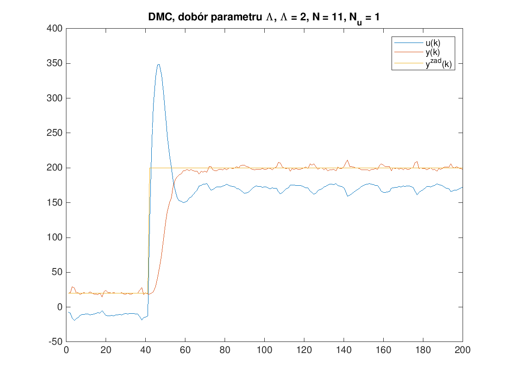
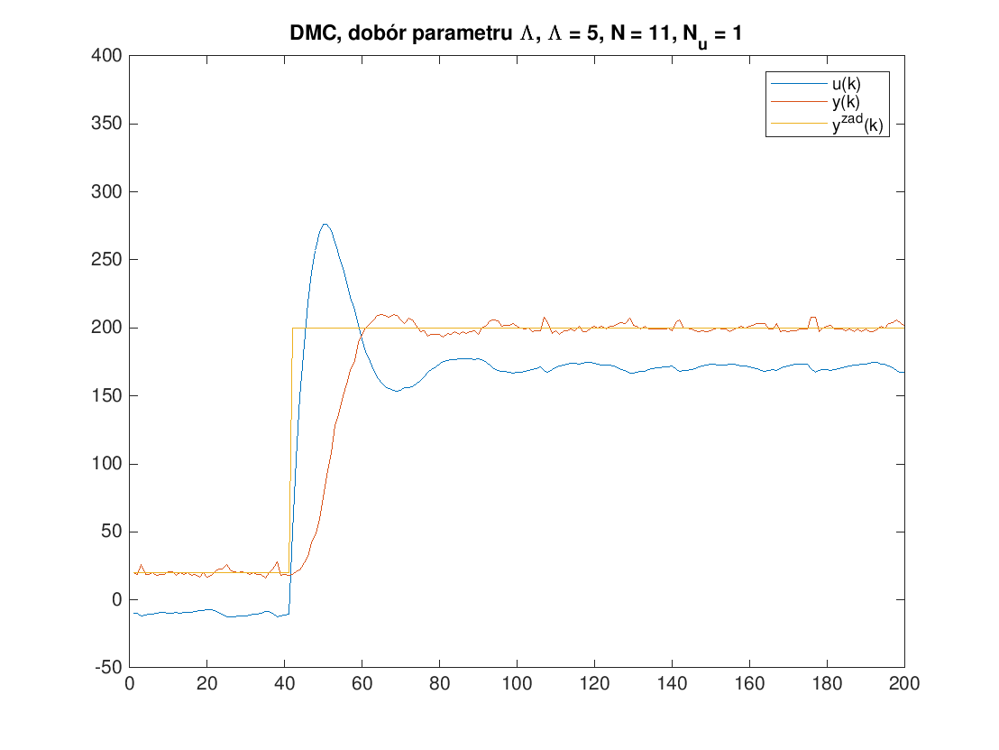
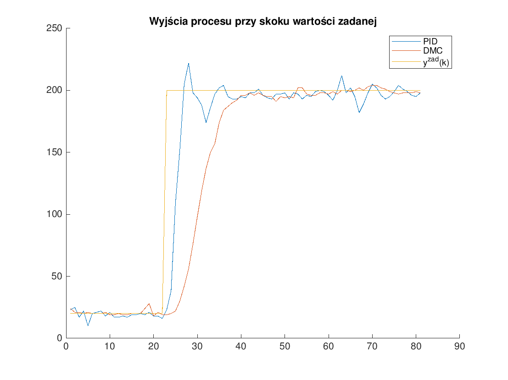

% SMS -- Projekt 1
% Krystian Chachuła, Marcin Dolicher
% 2. grudnia 2018

# Zagadnienia i założenia projektowe

Postawione przed nami zadanie polegało na zaprojektowaniu regulatora PID i DMC, które sterują obiektem zrealizowanym na mikrokontrolerach z serii STM32. Powinniśmy tak manipulować sygnałem wejściowym procesu *u*, aby wartość sygnału wyjściowego procesu (regulowanego) *y* była możliwie bliska wartości zadanej *y^{zad}*. Wartość uchybu *e=y^{zad} - y* powinna być jak najmniejsza. Wyniki uzyskane podczas eksperymentów zostaną porównane i poddane krytycznej weryfikacji. 

## Omówienie implementacji

Tradycyjnie regulację za pomocą algorytmu PID realizujemy za pomocą trzech członów proporcjonalnego, całkującego i różniczkującego. Człon proporcjonalny powoduje wzrost wartości sterowania wraz z wzrostem uchybu, całkujący zwiększa wartość sygnału sterującego wraz z akumulowanym uchybem, a dla różniczkującego wraz z wzrostem uchybu, wzrasta wartość sygnału sterującego. 

Implementacji algorytmu dokonaliśmy w plikach *Pid.c* i *Pid.h*. Parametry PID-a zostały w kodzie zaprezentowane jako struktura *Pid*. W pliku *main.c* zadajemy wartości odpowiednim parametrom z struktury PID. Wymagane obliczenia w algorytmie są realizowane za pomocą funkcji float pidCe(Pid *pid, float pv), której argumentami są struktura z wartościami naszego PID-a i zmienna *pv - process value*, czyli naszą wartość zadaną, a funkcja zwraca nam sygnał sterujący. 

W każdym wywołoniu funkcji dokonujemy następujących obliczeń: 

1. Wyliczamy uchyb na podstawie wzoru: e(k) = y^{zad}(k) - y(k)

2. Wartość członu proporcjonalnego  
   $$
   u(P)=Ke(k)
   $$

3. Wartość członu całkującego 
   $$
   u_{I}(k) = u_{I}(k-1) + \dfrac{K}{T_{I}}T\dfrac{e(k-1)+e(k)}{2}
   $$

4. _Wartość członu różniczkującego _
   $$
   u_{D}(k) = KT_{D}\dfrac{e(k)-e(k-1)}{T}
   $$

5. Następuje zapisanie wartości z stanu *k* jako wartości dla stanu *k-1* (w naszym kodzie zmienne z poprzedniego stanu wyrażone są za pomocą przedrostka prev)


Oprócz tych kroków do naszego algorytmu zastosowaliśmy rozwiązanie anti-windup. Rozwiązania tego używamy w przypadku gdy zmienna sterowania osiąga wartość graniczną urządzenia wykonawczego. Wiemy, że nie ma sensu zadawać większej wartości sygnału sterowania niż element wykonawczy jest w stanie zrealizować. W takiej sytuacji przerywamy pętlę sprzężenia zwrotnego i system zaczyna pracę w pętli otwartej. Takie rozwiązanie zapobiega ,,nawijaniu'' członu całkującego, czyli osiąganiu nadzwyczaj dużych wartości członu całkującego co prowadzi do ogromnego spowolnienia działania regulatora, a w skrajnych przypadkach do jego rozregulowania. 

Odp skokowa !!!!!!!!!!!!!!!!??????????????????????
Dostrajanie regulatora odbywało się na zasadzie pozyskiwania odpowiedz skokowej. Obserwując w jaki sposób sygnał sterujący generowany przez regulator osiąga wartość zadaną podczas skoku dokonywaliśmy oceny regulacji. W ten sposoób wybieraliśmy najlepsze nastawy dla regulatora. 

## Wyznaczanie nastawów regulatora metodą Zieglera-Nicholsa

Przbieg strojenia regulatora przy użyciu metody Zieglera-Nicholsa

1. Implementujemy regulator typu P.

2. Wartość wzmocnienia K dobieramy tak aby wyjście obiektu regulacji miało charakter oscylacyjny (nierosnący, niemalejący). Przyjmujemy wzmocnienie krytyczne 
   $$
   K_{u} = K
   $$
   Odczytujemy jeszcze okres oscylacji: 
   $$
   T_{u}
   $$
   

   Po wykonaniu tych punktów uzyskujemy powyższy wykres na którym wyraźnie widać oscylacje niegasnące i niemalejące wyjścia regulatora. Okres oscylacji to czas pomiędzy dwoma sąsiadującymi wierzchołkami lub dołkami. 

3. Używając tabelki wyliczamy parametry K, T__{I}, T_{D}  w zależności od regulatora który chcemy stosować P, PI, PID. My oczywiście wybiermay wzory dla PID.

   ​								 

4. Wyznaczone parametry powinny zapewnić niezłą jakość regulacji, gdy będziemy chcieli spróbować znaleźć lepszy regulator zaczęcie od nastawów wyznaczonych metodą Zieglera-Nicholsa będzie dobrym pomysłem.

   

   Wykres przedstawia przebiegi sygnałów dla nastawów wyliczonych według tabelki. Jeżeli nie sterujemy mocno skomplikowanym obiektem i amplituda zmian wartości zadanej nie jest zbyt duża. To jakość regulacji możemy uznać za satysfakcjonującą. Wyjście obiektu bardzo szybko dochodzi do wartości zadanej i jest stabilne (nie oscyluje). Zmiana wartości sygnału sterującego na początku jest akceptowalna, a w późniejszym czasie (od próbki 60) zmiany mają charakter skoków o nie dużych amplitudach. Jest to wynik zakłóceń i szumów występujących w układzie. 

\newpage

# Algorytm DMC

## Implementacja

Implementację regulatora *Dynamic Matrix Control* zaczęliśmy od analizy programów doktora Piotra Marusaka, udostępnionego nam w ramach przedmiotu *Diagnostyka procesów przemysłowych*. Zawiera on implementację regulatora DMC w języku MATLAB oraz symulację jego działania. Na ich podstawie napisaliśmy program w języku C.

### Typ `Dmc`

Zaczęliśmy od stworzenia struktury reprezentującej regulator DMC oraz zapisaniu prototypów funkcji działających na tej strukturze.

```c
typedef struct Dmc {
  float ke;
  float *ku;
  float sp;
  float *deltaup;
  float uk;
  int D;
} Dmc;

void dmcInit(Dmc *dmc);
float dmcCe(Dmc *dmc, float pv);
```

Elementy struktury to kolejno:

Nazwa pola	Standardowe Oznaczenie	Opis
----------	----------------------	----
`ke`			$k_e$					współczynnik przy uchybie w prawie sterowania
`ku`			$k_u(k - p)$				tablica współczynników przy przeszłych przyrostach sygnału sterującego w prawie sterowania
`sp`			$y^{zad}$				wartość zadana wyjścia procesu
`*deltaup`	$\Delta u(k - p)$		tablica przeszłych przyrostów sygnału sterującego
`uk`			$u(k)$					aktualna wartość sygnału sterującego
`D`			$D$						horyzont dynamiki, odczytany z odpowiedzi skokowej

### Funckje operujące na typie `Dmc`

Funkcja `dmcInit` alokuje pamięć dla pola `*deltaup` oraz zeruje pole `uk`.

```c
void dmcInit(Dmc *dmc) {
    // calloc ~= malloc + initialize with zeros
    dmc->deltaup = calloc((size_t) (dmc->D - 1), sizeof(float));

    dmc->uk = 0;
}
```

\newpage

Funkcja `dmcCe` oblicza i zwraca następną wartość sygnału sterującego na podstawie aktualnego wyjścia procesu `pv`. W pierwszym bloku obliczany jest uchyb oraz pierwszy człon przyrostu sygnału sterującego w chwili obecnej. W drugim bloku do aktualnego przyrostu sterowania dodawane są poprzednie przyrosty pomnożone przez odpowiednie współczynniki. W trzecim bloku tablica `deltaup` przesuwana jest o jedno miejsce w prawo, aby zrobić miejsce na obliczony nowy przyrost. Następnie obliczony przyrost dodawany jest do poprzedniej wartości sygnału sterującego, aby otrzymać nową wartość sygnału sterującego. Na koniec wartość ta jest zwracana.

```c
float dmcCe(Dmc *dmc, float pv) {
    float ek = dmc->sp - pv;
    float deltauk = dmc->ke * ek;
    int i;

    for (i = 0; i < dmc->D - 1; ++i) {
        deltauk -= dmc->ku[i] * dmc->deltaup[i];
    }

    // Shift deltaup[] right by one place
    for (i = dmc->D - 1; i > 0; i--) {
        dmc->deltaup[i] = dmc->deltaup[i - 1];
    }

    dmc->deltaup[0] = deltauk;

    dmc->uk += dmc->deltaup[0];

    return dmc->uk;
}
```

### Użycie regulatora

Poniżej przedstawiony jest przykład użycia powyższego regulatora.

```c
Dmc dmc;
dmc.D = 12;
dmc.ke = 0.5729;
dmc.sp = 10;

// ku has D-1 elements
float ku[11] = {
    0.4704, 0.3293, 0.2306, 0.1615, 0.1131, 0.0793, 
    0.0556, 0.0391, 0.0272, 0.0179, 0.0091
};
dmc.ku = ku;

dmcInit(&dmc);

while (true) {
    // ...
    u = dmcCe(&dmc, y);
}
```

## Dobór parametrów $N$, $N_u$ i $\lambda$

Zgodnie z zaleceniami prowadzącego ćwiczenia, doboru parametrów regulatora dokonywaliśmy zgodnie z poniższym algorytmem.

1. Przyjąć $N = N_u = D$ oraz $\lambda = 1$
2. Zmniejszać $N = N_u$ aż jakość regulacji zacznie być niesatysfakcjonująca.
3. Przyjąć $N$ takie, jak przy ostatniej *dobrej* próbie.
4. Zmniejszać $N_u$ aż jakość regulacji zacznie być niesatysfakcjonująca.
5. Przyjąć $N_u$ takie, jak przy ostatniej *dobrej* próbie.
6. Zwiększać $\lambda$ aż jakość regulacji zacznie być niesatysfakcjonująca.
7. Przyjąć $\lambda$ takie, jak przy ostatniej *dobrej* próbie.

## Dobór horyzontu predykcji $N$

Dla dużych $N$ jakość regulacji była bardzo dobra. Nie występowało przeregulowanie, a czas regulacji był równy ok. 20 czasów próbkowania.

{ width=50% }
{ width=50% }
{ width=50% }
{ width=50% }
{ width=50% }

Dla $N <= 10$ na wykresie zaczęło pojawiać się przeregulowanie, a czas regulacji wzrastał.

{ width=50% }
{ width=50% }
{ width=50% }

Ustaliliśmy, że punktem załamania jakości regulacji jest $N = 11$, zatem tę wartość wybraliśmy do dalszych rozważań.

## Dobór horyzontu sterowania $N_u$

Wpływ horyzontu sterowania na jakość regulacji nie był duży. Z tego powodu wybraliśmy $N_u = 1$, aby zmniejszyć ilość obliczeń wykonywanych co okres próbkowania regulatora. Decyzja ta nie spowodowała spadku jakości regulacji. Jedyną zmianą było nieznaczne zwiększenie się maksymalnej wartości sygnału sterującego z $376.5$ na $398.2$.

{ width=50% }
{ width=50% }
{ width=50% }
{ width=50% }

\newpage

## Dobór kary za zmiany sterowania $\lambda$

Parametr $\Lambda$ bardzo silnie wpływał na czas regulacji, zgodnie z naszymi oczekiwaniami. Gdy go zwiększaliśmy, czas regulacji rósł. Obiekt z którym mieliśmy do czynienia był obiektem o szybkiej dynamice. Z tego powodu, oraz ponieważ sygnał sterujący z łatwością mieścił się w ograniczeniach, zdecydowaliśmy, że nie będziemy tak mocno ograniczać jego zmian. Ustaliliśmy że najlepszą jakość regulacji nasz regulator daje nam przy $\Lambda = 1$.

{ width=50% }
{ width=50% }
{ width=50% }
{ width=50% }

# Porównanie dobranych regulatorów PID i DMC

## Wpływ zakłóceń na regulację

{ width=50% }
{ width=50% }
{ width=50% }

Z powyższych przebiegów wnioskujemy, że dobrany przez nas metodą inżynierską regulator PID lepiej radzi sobie z nieuwzględnionymi w układzie regulacji zakłóceniami niż regulator DMC. Ma to związek z bardzo dużym czasem różniczkowania ($T_d = 0.075$) w porównaniu do wstępnych nastaw dobranych metodą *Zieglera-Nicholsa* ($T_d = 0.047$). Duży udział różniczki w tym regulatorze można rozpoznać po bardzo silnej reakcji na szum pomiarowy (bardzo nieregularny przebieg sygnału sterującego). Gdy duży jest udział różniczki, regulator szybko reaguje na niespodziewany skok wyjścia obiektu (na skutek zakłócenia), ponieważ wtedy różniczka z uchybu drastycznie zmienia się na krótki czas. Powoduje to, że zakłócenie jest natychmiast kontrowane chwilowym obniżeniem (w tym przypadku) sygnału sterującego.

## Przeregulowanie, czas regulacji i oscylacje


{ width=50% }
{ width=50% }
{ width=50% }
{ width=50% }

Parametry regulacji odczytaliśmy z wykresów za pomocą kursora.

	Przeregulowanie	Czas regulacji[^1]	Oscylacje[^2]
---	---------------	--------------		---------
PID		11%				13				widoczne
DMC		0%[^3]			17				niewidoczne

Jak widać z powyższej tabeli, regulator *DMC* zapewnia lepszą jakość regulacji. Przy małym zwiększeniu czasu regulacji względem *PID*, otrzymujemy brak przeregulowania oraz gładkie przebiegi sygnału sterującego oraz wyjścia procesu.

Takie wyniki regulatora *DMC* zawdzięczamy temu, że jest to regulator predykcyjny. Pozwalają one na tworzenie gładkich przebiegów, ponieważ korzystają z modelu obiektu.

[^1]: Zmierzony dla $\epsilon = 20$.
[^2]: Ocenione wizualnie z wykresu.
[^3]: Przeregulowanie było na tyle małe, że nie udało nam się odróżnić go od szumu pomiarowego.